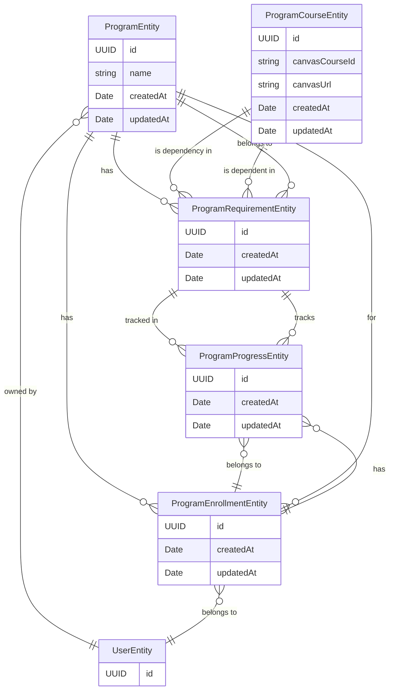

# Page 1

Welcome to the Petstore OpenAPI documentation!

## Features

* RESTful API
* OpenAPI Specification
* Example endpoints

## Getting Started

1. Clone the repository
2. Install dependencies
3. Run the server

## Example Code

```bash
git clone https://github.com/example/petstore_openapi.git
cd petstore_openapi
```

## Mermaid support



## License

See the [LICENSE](../LICENSE/) file for details.
